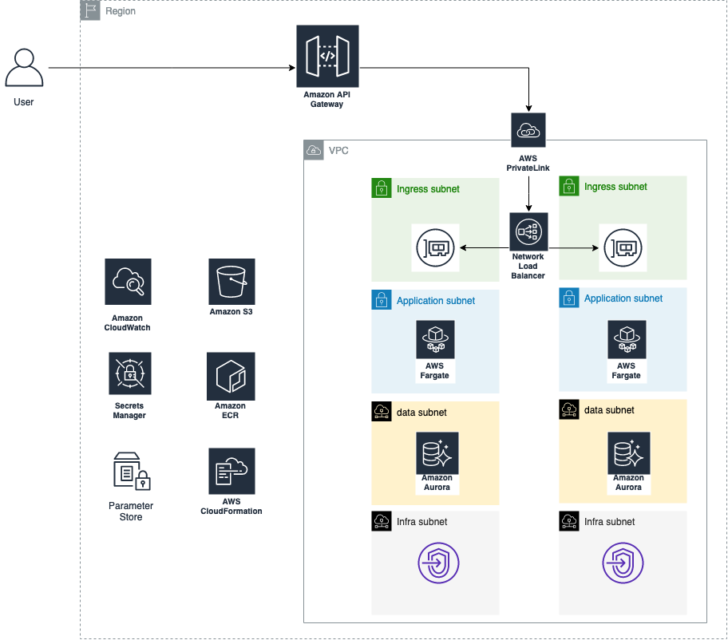

# cdk-ecs-fargate-nlb
Demo ECS Fargate Cluster Deployment with CDK Typescript
=======

# High Level Diagram

## Resource created: 
- VPC Fully Private
- VPC EndPoints
- Network LB + Listener targetting ECS Service 
- ECS Cluster
- ECS Fargate Task Definition
- ECS Service + ECS Task
- HTTP API Gateway
- API Gateway VPCLink

